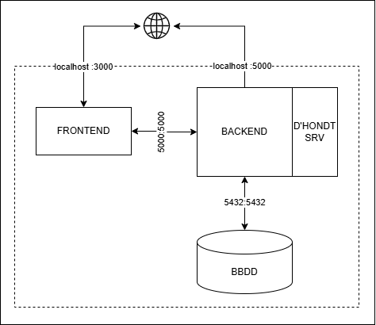
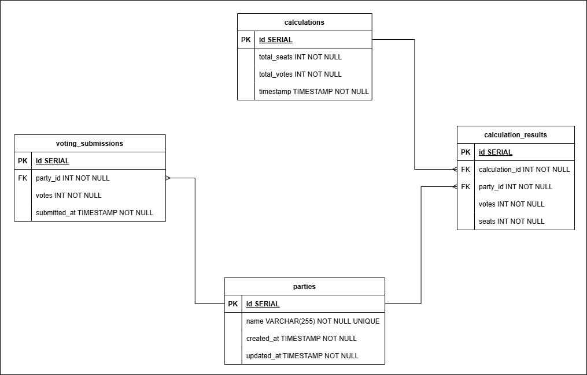

# Sistema de Asignación de Escaños D'Hondt

**TL;DR**
[Ejecutar el sistema](#10-ejecucion)

## 1. Introducción
El producto surge como una propuesta desarrollada a partir de la consigna planteada en `docs/guideline/`.
Su propósito es gestionar el registro, almacenamiento y cálculo de la asignación de escaños en procesos electorales **provinciales** mediante el método proporcional D’Hondt.

## 2. Desiciones de diseño
[DDD.md](/docs/guideline/DDD.md)

## 2. Alcance
El sistema permite: 
- Registrar los votos emitidos por partido político.
- Calcular la distribución de escaños según el sistema D’Hondt.
- Consultar los resultados históricos.

## 3. Arquitectura

La arquitectura se basa en microservicios independientes:
- Frontend (Astro): interfaz para interacción del usuario.
- Backend API: servicio REST encargado de la lógica del cálculo y gestión de datos.
- Base de datos PostgreSQL: almacenamiento persistente.
- Orquestación: Docker Compose para levantar todo el entorno con un solo comando.



## 4. Persistencia



## 5. Recursos
Recursos utilizados para la toma de decisiones de diseño.

- [Sistema D'hondt [Referencia general]](https://es.wikipedia.org/wiki/Sistema_D%27Hondt)
- [Sistema D'hondt [Referencia legal local]](https://buenosaires.gob.ar/sites/default/files/media/document/2021/11/03/cf6fa751bd98e12d862873d24f0417820d5d6f5c.pdf)
- [The D’Hondt Method Explained [Referencia formal]](https://www.ucl.ac.uk/~ucahhwi/dhondt.pdf)
- [Apportionment Python Library [Referencia tecnica]](https://github.com/martinlackner/apportionment)
- [D'Hondt Simulator for Python [Referencia tecnica]](https://github.com/onurgitmez/dhondt-python)
- [Simulador de La Ley d'Hondt [Referencia funcional]](https://www.estadisticaparatodos.es/software/misjavascript/javascript_hondt2.html)

## 6. Ejecucion

```shell
# DEV [Desde CLI]
./run.sh

# DEV [Desde codigo fuente]
docker compose --env-file .env -f docker-compose.dev.yml up -d --build

# PRD [Desde imagenes en DockerHub]
docker compose --env-file .env -f docker-compose.prd.yaml up -d
```

**Accesibilidad**
- Frontend: `localhost:3000`
- API endpoints: `localhost:5000/docs`
